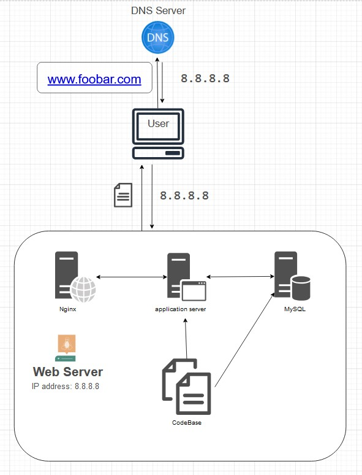

# Simple Web Stack

## Description

This is a simple web infrastructure that hosts a website that is reachable via `www.foobar.com`. There is no firewall or SSL certificate for protecting the server's network. Each component (database, application server) has to share the resources (CPU, RAM, and SSD) provided by the server.

## Specifications of this Infrastructure

+ What is a server: A server is a computer hardware or software that provides services to other computers, which are usually referred to as *clients*.

+ The role of the domain name: To provide a user-friendly alias for an IP Address. For example, the domain name `www.wikipedia.org` is easier to recognize and remember than `91.198.174.192`. The IP address and domain name alias is mapped in the Domain Name System (DNS)

+ The type of DNS record `www` is in`www.foobar.com`. `www.foobar.com` uses an **A record**. This can be checked by running `dig www.foobar.com`. **Note:** the results might be different but for the infrastructure in this design, an **A** record is used. 

+ The role of the web server. The web server is a software/hardware that accepts requests via HTTP or secure HTTP (HTTPS) and responds with the content of the requested resource(s) or an error messsage/prompt.

+ The role of the application server. To install, operate and host applications and associated services for end users, IT services and organizations and facilitates the hosting and delivery of high-end consumer or business applications

+ The role of the database. To maintain a collection of organized information that can easily be accessed, managed, sorted and updated at any given point of time.

+ What is the server uses to communicate with the client (computer of the user requesting the website). Communication between the client and the server occurs over the internet network through the TCP/IP protocol suite.

## Lapses Associated with this Infrastructure

+ There are multiple SPOF (Single Point Of Failure) in this infrastructure. For example, if the MySQL database
is not accessible or the server is down, the entire site would be frustrating.

+ Downtime when maintenance is needed. When we need to run some maintenance checks on any component, they have to be put down or the server has to be turned off. Since there's only one server, the website would be experiencing a downtime.

+ Cannot scale if there's too much incoming traffic. It would be hard to scale this infrastructure because only one server contains the required components. The server can quickly run out of resources or slow down when it starts receiving a lot of requests.
